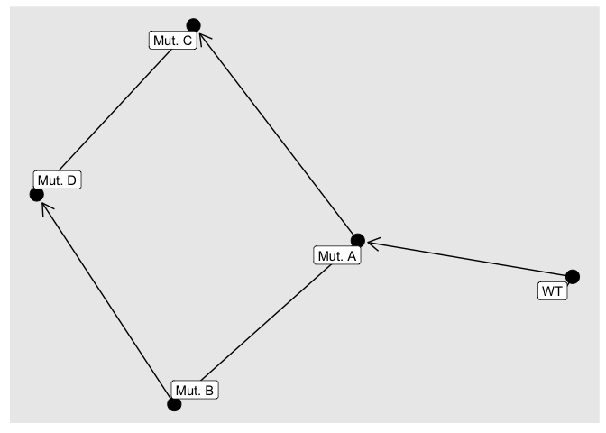
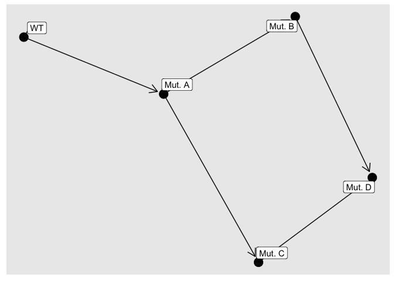

Oncogenetic network estimation with Bayesian Networks (OncoBN)
================
R Package version 0.1.0.

This is an R package that implements methods for inferring the temporal
order of somatic mutations in cancer.

## Installation

Run the following command from the R console:

``` r
devtools::install_github("phillipnicol/OncoBN")
```

## Input data

Input data should be somatic mutation data with samples (or patients) in
rows and mutations in the columns. The package includes an example
dataset:

``` r
library(OncoBN)
data("example")
head(example)
```

    ##          Mut. A Mut. B Mut. C Mut. D
    ## Sample 1      1      0      1      0
    ## Sample 2      1      1      1      0
    ## Sample 3      0      0      0      0
    ## Sample 4      1      1      1      1
    ## Sample 5      1      1      1      0
    ## Sample 6      1      1      1      0

## Inferring the order of mutations

Use the function `fitCPN()` to fit a Bayesian network to the data. The
two model options are conjunctive Bayesian networks (CBN) or disjunctive
Bayesian networks (DBN). CBNs assume conjunctive interactions between
parent and child nodes (i.e., all parent aberrations must be present in
order for the child aberration to occur). DBNs assume disjunctive
interactions between parent and child nodes (i.e., at least one of the
parent aberrations must be present in order for the child mutation to
occur). We can fit both models on the example data:

``` r
out.cbn <- fitCPN(example,
                  model="CBN",
                  epsilon=0.01)
```

    ## Loading data ... ... 
    ## Computing local scores ... ... 
    ## Computing best parent sets ... ... 
    ## Finding best sinks ... ...
    ## Finding best ordering ... ... 
    ## Building optimal network ... ... 
    ## Optimal network with score -1055.06 found in 0.000205 seconds.

``` r
out.dbn <- fitCPN(example,
                  model="DBN",
                  epsilon=0.01)
```

    ## Loading data ... ... 
    ## Computing local scores ... ... 
    ## Computing best parent sets ... ... 
    ## Finding best sinks ... ...
    ## Finding best ordering ... ... 
    ## Building optimal network ... ... 
    ## Optimal network with score -995.454 found in 0.000179 seconds.

The `epsilon` parameter determines the penalty applied to samples that
deviate from the estimated network. We recommend choosing `epsilon` to
be at most half the prevalence of the least common mutation in the
dataset.

Now we can use `plotCPN()` to see the estimated network:

``` r
plotCPN(out.cbn)
```

<!-- -->

``` r
plotCPN(out.dbn)
```

<!-- -->

## Quantifying uncertainty

`fitCPN()` returns a point estimate of the true progression network. To
quantify uncertainty in this network we can perform resampling to obtain
bootstrap estimates for the network. This is provided by
`bootstrapCPN()`:

``` r
bs <- bootstrapCPN(example,model="DBN")

df <- as.data.frame(cbind(bs$Edges, bs$counts/bs$N))
df[,3] <- as.numeric(df[,3])
df
```

    ##       V1     V2 V3
    ## 1     WT Mut. A  1
    ## 2 Mut. A Mut. B  1
    ## 3 Mut. A Mut. C  1
    ## 4 Mut. C Mut. D  1
    ## 5 Mut. B Mut. D  1

In this example we are 100% in each inferred edge. This is usually not
the case in real data. One can also plot a graph that overlays high
confidence edges, see `plotBootstrapCPN()`.

## References

For a description of the DBN model and corresponding inference
algorithms, see:

Nicol, P.B., Coombes, K.R., Deaver, C., Chkrebtii, O.A., Paul, S.,
Toland, A.E., and Asiaee, A. (2021). Oncogenetic network estimation with
disjunctive Bayesian networks. *Computational and Systems Oncology* Vol
1(2), pg. 1-e1027. <https://doi.org/10.1002/cso2.1027>.
