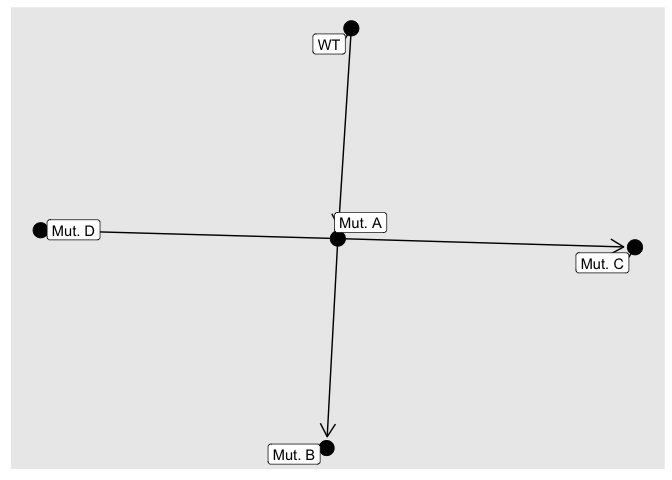

Oncogenetic network estimation with Bayesian Networks (OncoBN)
================
R Package version 0.1.0.

This is an R package that implements methods for inferring the temporal
order of somatic mutations in cancer.

## Input data

Input data should be somatic mutation data with samples (or patients) in
rows and mutations in the columns. The package includes an example
dataset:

``` r
library(OncoBN)
data("example")
head(example)
```

    ##          Mut. A Mut. B Mut. C Mut. D
    ## Sample 1      1      0      1      0
    ## Sample 2      1      1      1      0
    ## Sample 3      0      0      0      0
    ## Sample 4      1      1      1      1
    ## Sample 5      1      1      1      0
    ## Sample 6      1      1      1      0

## Inferring the order of mutations

Use the function `fitCPN()` to fit a Bayesian network to the data. The
two model options are conjunctive Bayesian networks (CBN) or disjunctive
Bayesian networks (DBN). CBNs assume conjunctive interactions between
parent and child nodes (i.e., all parent aberrations must be present in
order for the child aberration to occur). DBNs assume disjunctive
interactions between parent and child nodes (i.e., at least one of the
parent aberrations must be present in order for the child mutation to
occur). We can fit both models on the example data:

``` r
out.cbn <- fitCPN(example,
                  model="CBN",
                  epsilon=0.01)
```

    ## Loading data ... ... 
    ## Computing local scores ... ... 
    ## Computing best parent sets ... ... 
    ## Finding best sinks ... ...
    ## Finding best ordering ... ... 
    ## Building optimal network ... ... 
    ## Optimal network with score -1055.06 found in 0.00021 seconds.

``` r
out.dbn <- fitCPN(example,
                  model="DBN",
                  epsilon=0.01)
```

    ## Loading data ... ... 
    ## Computing local scores ... ... 
    ## Computing best parent sets ... ... 
    ## Finding best sinks ... ...
    ## Finding best ordering ... ... 
    ## Building optimal network ... ... 
    ## Optimal network with score -995.454 found in 0.000169 seconds.

Now we can use `plotCPN()` to see the estimated network:

``` r
plotCPN(out.cbn)
```

<!-- -->

``` r
plotCPN(out.dbn)
```

<!-- -->
